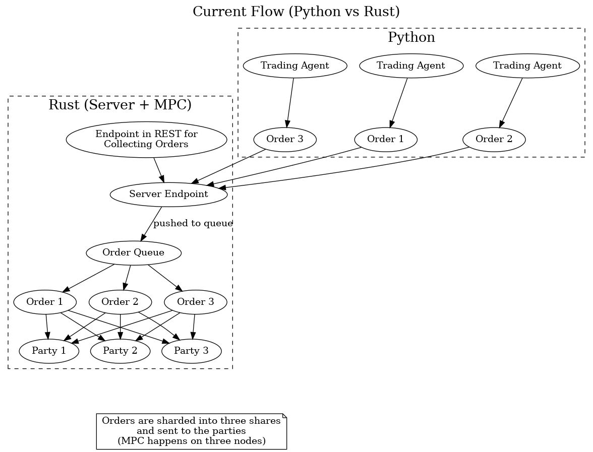
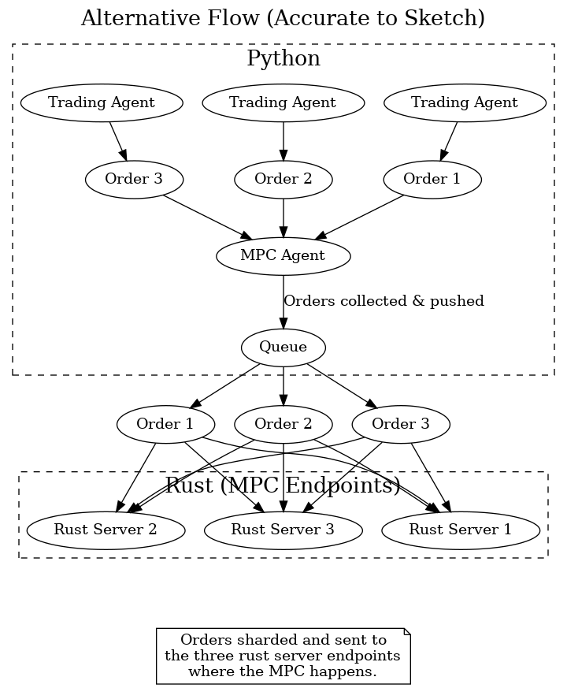

# Dark Pools Demo

_Note: This demo provides a minimal `Agent` base class in `agent_base.py` for agent logic simulation._

This demo showcases a dark pools trading system using the A2A Python SDK. The system consists of multiple agents:

1. Dark Pools Agent - Handles order matching securely
2. Market Data Agent - Provides real-time market information
3. Trading Agents - Submit buy/sell orders to the dark pool

## DOCUMENTATION
https://docs.google.com/document/d/1r0Tvx0ZaSb3HcnOCHE-W1CssPn2LPTU4yMPWIufR6Es/edit?usp=sharing

## FLOW DIAGRAM




## Features

- Secure order matching in dark pools
- Real-time market data using yfinance
- Multiple trading agents with different strategies
- Position and balance tracking for each trading agent

## Setup

See the Quickstart section below for the recommended way to set up and run the demo after cloning the repository.

## Quickstart: Running the Demo After Cloning

1. **Run the Rust backend:**
   ```bash
   cd backend && cargo build
   pkill -f relay_server (if it is already running)
   cd backend && cargo run --bin relay_server (it starts the relay server and it should be visible like this - Relay server listening on ws://0.0.0.0:9007)
   cd backend && cargo run --bin backend (Output should be like this - Order server listening on 127.0.0.1:8080)
   cd .. && python client.py (it should receive orders, launch the 3 parties and do the mpc computation)
   ```
   or

1. **Simply run the main.py file to simulate everything**
   ```bash
   cd examples/dark_pools && python main.py
   ```

## How it Works

**Order Matching Logic**
https://www.mermaidchart.com/raw/a6aa7998-016e-4425-9f4c-36accc11ac55?theme=light&version=v0.1&format=svg

**Comparison protocol**
https://www.mermaidchart.com/raw/292eeb14-4317-45f0-9921-61bf2cfc088a?theme=light&version=v0.1&format=svg

1. The Dark Pools Agent receives orders from trading agents and matches them based on price and quantity
2. The Market Data Agent provides real-time price information for stocks
3. Trading Agents submit random buy/sell orders and maintain their positions and balances
4. When orders are matched, the Dark Pools Agent notifies the relevant trading agents
5. Trading agents update their positions and balances based on matched orders

## Demo Duration

The demo runs for 5 minutes by default. You can modify the duration in `main.py` by changing the `asyncio.sleep(300)` value.

## Stopping the Demo

Press Ctrl+C to stop the demo gracefully. The system will:
1. Cancel all trading tasks
2. Stop the server
3. Clean up resources 
